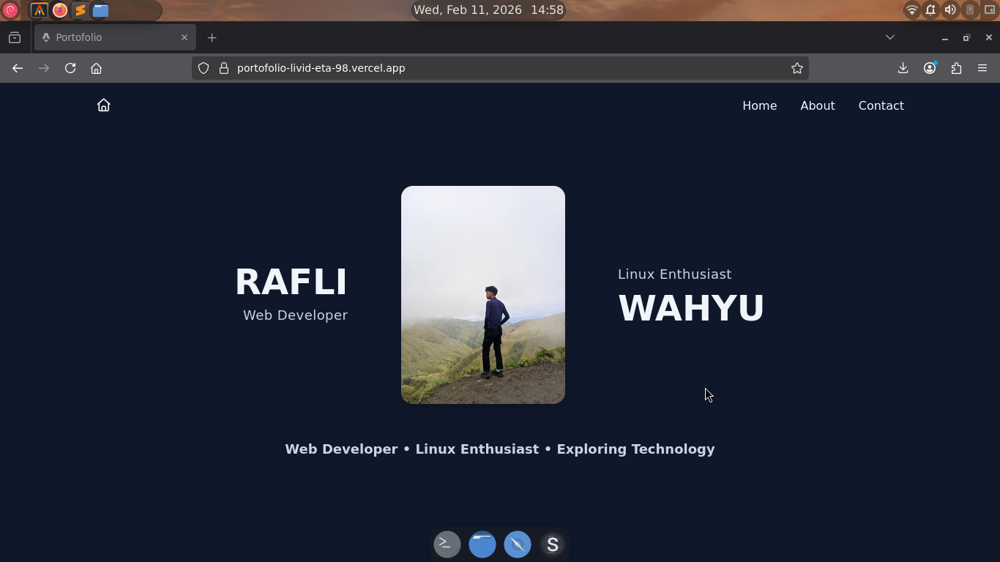

# 🚀 Portfolio Website - Rafli Wahyu


Personal portfolio website yang dibuat menggunakan **Astro + Tailwind CSS + AOS** untuk menampilkan profil, pendidikan, pengalaman PKL, dan kontak.  
Website ini sudah **live**: [https://portofolio-livid-eta-98.vercel.app/](https://portofolio-livid-eta-98.vercel.app/)

---

## 🌐 Live Preview

[](https://portofolio-livid-eta-98.vercel.app/)

Klik gambar untuk membuka live website.

---

## ✨ Tech Stack

- ⚡ **Astro** – framework static site modern  
- 🎨 **Tailwind CSS** – utility-first styling  
- 🎬 **AOS (Animate On Scroll)** – scroll animations  
- 🌐 **Font Awesome** – icons  
- 📦 **Node.js** – development environment  
- 📸 **WebP images** – optimized performance  

---

## 📂 Features

- Responsive design untuk desktop & mobile  
- Smooth scrolling navigation  
- Scroll to top button (floating)  
- Animated sections dengan AOS  
- Modern minimalistic design  
- Optimized image loading & performance  

---

## 🏗️ Project Structure

```text
portofolio/
├── astro.config.mjs
├── LICENSE
├── package.json
├── package-lock.json
├── public/
│   ├── favicon.ico
│   └── preview.png
├── README.md
├── src/
│   ├── assets/
│   │   ├── astro.svg
│   │   ├── background.svg
│   │   └── bromo.webp
│   ├── components/
│   │   ├── Home.astro
│   │   └── Welcome.astro
│   ├── layouts/
│   │   └── Layout.astro
│   ├── pages/
│   │   └── index.astro
│   └── styles/
│       └── global.css
└── tsconfig.json
